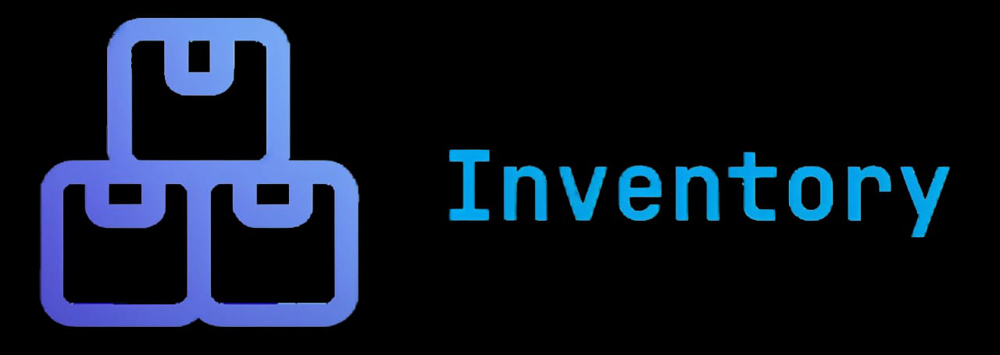

<p align="center"><a href="https://laravel.com" target="_blank"></a></p>

<h2 align="center">Contributor</h2>

<p align="center">
    <a href="https://github.com/NathanAbrahamSinaga" target="_blank">
        
    </a>
    <a href="https://github.com/EKZETA" target="_blank">
        
    </a>
    <a href="https://github.com/danangfir" target="_blank">
        
    </a>
</p>

## About Inventory
Dashboard Inventory Barang adalah aplikasi berbasis web yang dirancang untuk membantu admin dalam mengelola dan memantau stok barang secara efisien

Sistem ini memungkinkan admin untuk mencatat barang masuk dan keluar, mengelola data barang, serta menghasilkan laporan terkait pergerakan stok secara real-time 

Dibangun menggunakan **FilamentPHP** untuk menyediakan antarmuka admin yang user-friendly, aplikasi ini menawarkan kemudahan dalam pengelolaan inventaris, memudahkan admin dalam mengambil keputusan yang cepat dan akurat mengenai persediaan barang, serta menjaga kelancaran operasional bisnis

## <font color="red"> ! Before launching your project, follow these essential setup steps:</font>

## Setup Proyek Laravel dengan FilamentPHP dan Blade

Berikut adalah langkah-langkah untuk menyiapkan proyek Laravel menggunakan **FilamentPHP** untuk admin panel dan **Blade** sebagai templating engine

## Langkah-langkah Instalasi

1. **Clone Repository**
   Clone repository ini ke mesin lokal:
   ```bash
   git clone <repository-url>
   ```

2. Pindah ke direktori proyek yang telah di-clone:
    ```
    cd <nama_proyek>
    ```

3. Install Dependencies dengan Composer Install dependensi PHP menggunakan Composer:
    ```
    composer install
    ```

4. Install Dependencies dengan Yarn Install dependensi frontend menggunakan Yarn:
    ```
    yarn add vite --dev
    yarn build
    ```

5. Konfigurasi .env Salin file konfigurasi .env.example ke .env:
    ```
    cp .env.example .env
    ```

6. Generate Key Aplikasi Laravel Jalankan perintah berikut untuk menghasilkan aplikasi key yang unik:
    ```
    php artisan key:generate
    ```

7. Buat Link untuk Storage Jalankan perintah untuk membuat symbolic link ke direktori storage:
    ```
    php artisan storage:link
    ```

8. Migrasi Database Jalankan migrasi untuk membuat struktur tabel di database:
    ```
    php artisan migrate
    ```

9. Seed Database (Opsional) Jika Anda ingin menambahkan data dummy untuk pengembangan, jalankan perintah seed:
    ```
    php artisan migrate --seed

    ```

10. Jalankan Server Jalankan server lokal Laravel:
    ```
    php artisan serve
    ```

## License

Open-sourced software licensed under the [MIT license](https://opensource.org/licenses/MIT).
